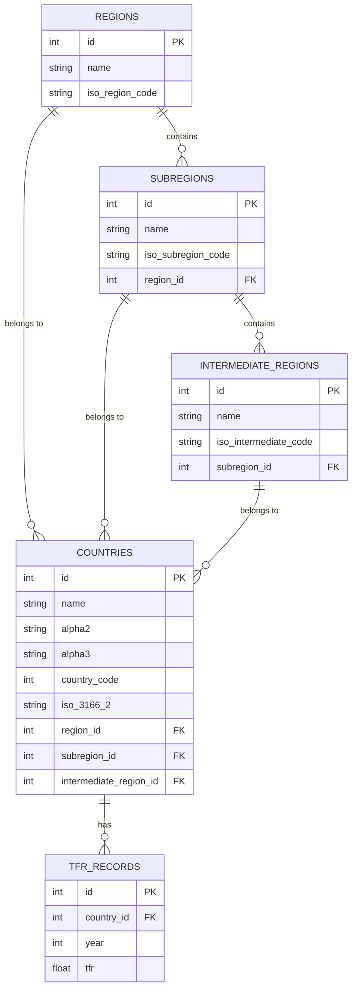

# 🌍 Total Fertility Rate (TFR) Analytics Dashboard

**CIS Software Engineering Final Exam 2025**

A comprehensive three-tier web application for analyzing global Total Fertility Rate data with full CRUD operations, built using Express.js, HTMX, SQLite, and Docker.

---

## 📊 Project Overview

This application provides an interactive dashboard for exploring demographic trends through Total Fertility Rate (TFR) data across countries, regions, and time periods. The system implements a normalized database design (3NF) with 8 key features including data visualization, search, analysis, and full CRUD operations.

### Key Features

✅ **Requirement 1**: Country TFR History (Descending Order)  
✅ **Requirement 2**: Sub-region Country Rankings (Ascending by TFR)  
✅ **Requirement 3**: Regional Average TFR Analysis  
✅ **Requirement 4**: Keyword Search with Latest TFR  
✅ **Requirement 5**: Add Next Year TFR Record  
✅ **Requirement 6**: Update Existing TFR Records  
✅ **Requirement 7**: Delete TFR Records by Year Range  
✅ **Requirement 8**: Global Trends Visualization (Custom Feature)

---

## 🗄️ Database Design (3rd Normal Form)

### Entity-Relationship Diagram



### Normalization Compliance

- **1NF**: All attributes are atomic, no repeating groups
- **2NF**: No partial dependencies; all non-key attributes fully depend on primary key
- **3NF**: No transitive dependencies; no non-key attribute depends on another non-key attribute
- **Entities**: 5 tables (regions, subregions, intermediate_regions, countries, tfr_records)

---

## 🚀 Quick Start

### Prerequisites

- Docker Desktop installed
- Git installed
- Ports 3000 available

### Installation & Running

```bash
# 1. Clone the repository
git clone https://github.com/seizuto/cis-exam.git
cd cis-exam

# 2. Start the application
docker compose up

# 3. Access the application
# Open browser to: http://localhost:3000
```

That's it! The application will automatically:
- Build the Docker container
- Initialize the SQLite database
- Load and transform CSV data (ETL)
- Start the web server

### Manual Installation (Without Docker)

```bash
# Install dependencies
npm install

# Ensure data files exist in ./data/ directory
# - data1.csv (TFR records)
# - data2.csv (Geographic data)

# Start server
npm start

# Access at http://localhost:3000
```

---

## 📁 Project Structure

```
/cis-exam
│
├── /data                    <-- 📂 Folder for Data
│   ├── data1.csv            (Original TFR Data)
│   ├── data2.csv            (Original Regions Data)
│   └── tfr_database.sqlite  (The database file generated by your code)
│
├── /public                  <-- 📂 Folder for Static Files
│   └── style.css            (Optional custom CSS)
│
├── /routes                  <-- 📂 Folder for Logic (Tier 2)
│   ├── api.js               (Handles data calculations & CRUD)
│   └── frontend.js          (Handles HTML generation)
│
├── /views                   <-- 📂 Folder for Layouts (Tier 1)
│   └── layout.js            (The HTML shell: <head>, nav, footer)
│
├── compose.yaml             (Docker Compose configuration)
├── database.js              (Database connection & ETL logic)
├── Dockerfile               (Docker image instructions)
├── ETL.sql                  (Required for the exam: SQL commands text)
├── package.json             (Project dependencies)
├── README.md                (Project documentation)
└── server.js                (Main entry point)
```

---

## 🔧 Technology Stack

### Backend
- **Node.js 18+** - JavaScript runtime
- **Express.js 4.x** - Web framework
- **SQLite3** - Embedded database
- **csv-parser** - CSV data processing

### Frontend
- **HTMX 1.9** - Dynamic HTML without heavy JavaScript
- **Tailwind CSS 3.x** - Utility-first CSS framework
- **Chart.js 4.x** - Data visualization
- **jsvectormap** - Interactive world map library
- **Hyperscript** - Client-side scripting

### DevOps
- **Docker & Docker Compose** - Containerization
- **Alpine Linux** - Lightweight base image

---

## 📋 Feature Documentation

### 1️⃣ Country History (Requirement 1)

Displays TFR trends over time for a selected country in **descending year order**.

**Usage**: Select a country from dropdown → View line chart

**Implementation**: 
```sql
SELECT year, tfr 
FROM tfr_records 
WHERE country_id = ? 
ORDER BY year DESC
```

---

### 2️⃣ Sub-region Analysis (Requirement 2)

Shows all countries in a sub-region for a specific year, ordered by **ascending TFR**.

**Usage**: Select sub-region + year → View ranked list

**Implementation**:
```sql
SELECT c.name, t.tfr
FROM countries c
JOIN tfr_records t ON c.id = t.country_id
WHERE c.subregion_id = ? AND t.year = ?
ORDER BY t.tfr ASC
```

---

### 3️⃣ Regional Averages (Requirement 3)

Calculates average TFR for all sub-regions within a region for a given year.

**Usage**: Select region + year → View aggregated averages

**Implementation**:
```sql
SELECT s.name, AVG(t.tfr) as avg
FROM subregions s
JOIN countries c ON s.id = c.subregion_id
JOIN tfr_records t ON c.id = t.country_id
WHERE s.region_id = ? AND t.year = ?
GROUP BY s.id
ORDER BY s.region_id, avg
```

---

### 4️⃣ Country Search (Requirement 4)

Searches countries by partial name match and displays their **latest TFR** (not hardcoded to 2023).

**Usage**: Type country name → See real-time results

**Implementation**:
```sql
SELECT c.name,
       (SELECT tfr FROM tfr_records 
        WHERE country_id = c.id 
        ORDER BY year DESC LIMIT 1) as latest_tfr
FROM countries c
WHERE c.name LIKE ?
ORDER BY c.name
```

---

### 5️⃣ Add Next Year (Requirement 5)

Adds a new TFR record for the next year using the previous year's value.

**Usage**: Select country → Click Add → New record created

**Validation**: 
- Checks if country has existing data
- Uses last known TFR value
- Prevents duplicate year entries

---

### 6️⃣ Update Record (Requirement 6)

Updates an existing TFR value for a specific country and year.

**Usage**: Select country + year + new TFR → Click Update

**Validation**:
- Year must exist for that country
- TFR must be between 0 and 15

---

### 7️⃣ Delete Range (Requirement 7)

Deletes all TFR records for a country within a specified year range.

**Usage**: Select country + start year + end year → Confirm deletion

**Safety**: Confirmation dialog prevents accidental deletion

---

### 8️⃣ Global Trends (Requirement 8 - Custom Feature)

Visualizes TFR trends across all regions over a custom time period.

**Usage**: Enter start/end years → Click Analyze → View multi-line chart

**Features**:
- Compare regional fertility trends
- Adjustable time range
- Color-coded by region
- Interactive Chart.js visualization

---

### 🎨 Custom Features (Beyond Requirements)

#### **Feature A: Country Comparison**
Compare TFR trends between two countries side-by-side with interactive visualization.

**Usage**: Select two different countries → View dual-line comparison chart

**Features**:
- Side-by-side trend comparison
- Percentage difference calculation
- Synchronized time axis
- Latest year statistical summary

**Implementation**:
```javascript
// Compare endpoint with dual datasets
router.get('/compare', ...)
```

---

#### **Feature B: Interactive World Map**
Global TFR heatmap using jsVectorMap with color-coded countries.

**Usage**: Select year → View world map with TFR intensity

**Color Scale**:
- 🟢 Green (High): TFR ≥ 3.0
- 🟢 Light Green: TFR 2.1-3.0 (Above Replacement)
- 🟠 Orange: TFR 1.5-2.1 (Replacement Level)
- 🔴 Red (Low): TFR < 1.5
- ⚪ Gray: No Data

**Features**:
- Interactive pan and zoom
- Hover tooltips with country details
- Dynamic legend
- Responsive design

---

#### **Feature C: Linear Forecast**
Predicts next 5 years of TFR using linear regression on the last 10 years.

**Usage**: Select country → View historical + predicted trends

**Statistical Method**:
- Uses least-squares linear regression
- Requires minimum 5 years of data
- Calculates trend direction and annual change rate
- Displays confidence with dashed forecast line

**Features**:
- Visual separation between historical and forecast
- Trend analysis (increasing/decreasing)
- Annual percentage change indicator
- 5-year forward projection

---

## 🎯 Feature Summary Table

| Feature | Type | Description | Visualization |
|---------|------|-------------|---------------|
| **Req 1** | Query | Country TFR History | Line Chart |
| **Req 2** | Query | Sub-region Rankings | Ranked List |
| **Req 3** | Query | Regional Averages | Grouped List |
| **Req 4** | Search | Keyword Search | Live Results |
| **Req 5** | CRUD | Add Next Year | Auto-increment |
| **Req 6** | CRUD | Update Record | Form Update |
| **Req 7** | CRUD | Delete Range | Batch Delete |
| **Req 8** | Custom | Global Trends | Multi-line Chart |
| **Feature A** | Bonus | Country Comparison | Dual-line Chart |
| **Feature B** | Bonus | World Heatmap | Interactive Map |
| **Feature C** | Bonus | Linear Forecast | Predictive Chart |

**Total**: 8 Required + 3 Bonus = **11 Features** ✨

---

## 🔐 Data Quality & Validation

### ETL Process

1. **Extract**: Read CSV files with BOM handling
2. **Transform**: 
   - Clean headers (trim whitespace, remove BOM)
   - Validate data types
   - Remove invalid records (NULL, negative, out of range)
3. **Load**: Use transactions for atomicity

### Data Validation Rules

- **TFR**: Must be between 0 and 15
- **Year**: Must be between 1900 and 2100
- **Countries**: Unique alpha-3 codes
- **Referential Integrity**: All foreign keys enforced

### Performance Optimizations

- 6 strategic indexes on frequently queried columns
- Transaction-based bulk inserts
- Connection pooling
- Query result caching where appropriate

---

## 🧪 Testing

### Manual Testing Checklist

- [ ] All 8 requirements functional
- [ ] Charts render correctly
- [ ] CRUD operations work without errors
- [ ] Search provides instant results
- [ ] Data validation prevents invalid inputs
- [ ] Docker deployment works on fresh machine
- [ ] All dropdowns populated correctly
- [ ] Toast notifications appear for actions

### Sample Test Queries

```bash
# Test Req 1: View USA history
curl "http://localhost:3000/api/history?country_id=1"

# Test Req 4: Search for "United"
curl "http://localhost:3000/api/search?search=United"

# Test Req 5: Add next year for USA
curl -X POST http://localhost:3000/api/add-year \
  -H "Content-Type: application/json" \
  -d '{"country_id": 1}'
```

---

## 📈 Data Sources

- **TFR Statistics**: [Our World in Data](https://ourworldindata.org/)
- **Geographic Metadata**: [Kaggle](https://www.kaggle.com/)

### Data Fields

**data1.csv** (TFR Records):
- Entity, Code (alpha-3), Year, TFR

**data2.csv** (Geography):
- name, alpha-2, alpha-3, region, sub-region

---

## 🐛 Troubleshooting

### Issue: Port 3000 already in use
```bash
# Stop existing container
docker compose down

# Or use different port
# Edit compose.yaml: ports: "3001:3000"
```

### Issue: Database not loading
```bash
# Remove database and restart
rm data/tfr_database.sqlite
docker compose up --build
```

### Issue: CSV files not found
```bash
# Ensure files exist
ls -la data/
# Should show: data1.csv, data2.csv
```

---

## 👨‍💻 Development Notes

### Code Quality
- Clean, readable code with comments
- Consistent naming conventions
- Error handling for all database operations
- Input validation on all forms

### Future Enhancements
- [ ] Export data to CSV
- [ ] User authentication
- [ ] Advanced filtering options
- [ ] Predictive modeling
- [ ] Mobile responsive improvements
- [ ] API rate limiting
- [ ] Unit tests with Jest

---

## 🙏 Acknowledgments

- **Course**: Software Engineering in CIS
- **Instructor**: Yo-Ming Hsieh
- **Institution**: National Taiwan University of Science and Technology
- **Year**: 2025

---

## 📧 Contact

- **Student Name**: Steven Gaillard
- **Student ID**: D11405806
- **Email**: gacchuguts@gmail.com

---

**Note**: This project demonstrates database normalization, ETL processes, RESTful API design, modern web development with HTMX, and containerized deployment with Docker.
